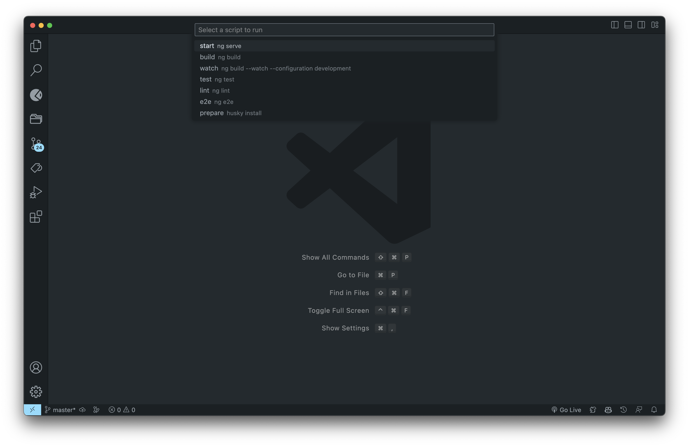

## Features

Scripty is a powerful VSCode extension that streamlines the execution of package.json scripts. It simplifies your development workflow by providing an intuitive dropdown menu to run scripts effortlessly.

- **Effortless Execution:** Run package.json scripts with a single click, eliminating the need for manual command entry.
- **Intuitive Dropdown:** Access a user-friendly dropdown menu that lists all your package.json scripts for easy selection.
- **Time-Saving:** Enhance your productivity by executing scripts directly within the editor.

## Requirements

There are no specific requirements or dependencies for this extension. Simply install it to get started.

## Keyboard Shortcuts

Scripty provides convenient keyboard shortcuts to quickly access its functionality:

- **Mac**: Press `Cmd + Shift + l`
- **Windows**: Press `Ctrl + Shift + l`

## Using Command Palette

You can also use the Command Palette to access Scripty's functionality:

1. Press `Cmd + Shift + P` (Mac) or `Ctrl + Shift + P` (Windows/Linux) to open the Command Palette.
2. Type in "Scripty: Show Scripts" and select the corresponding command from the list.

This will open the Scripty dropdown menu, allowing you to execute package.json scripts with ease.

### 1.0.0

Initial release of Scripty.

<!-- ### 1.0.1

Fixed issue #123: Description of the issue or bug that was fixed.

### 1.1.0

Added features X, Y, and Z to enhance user experience. -->

---

**Enjoy!**
